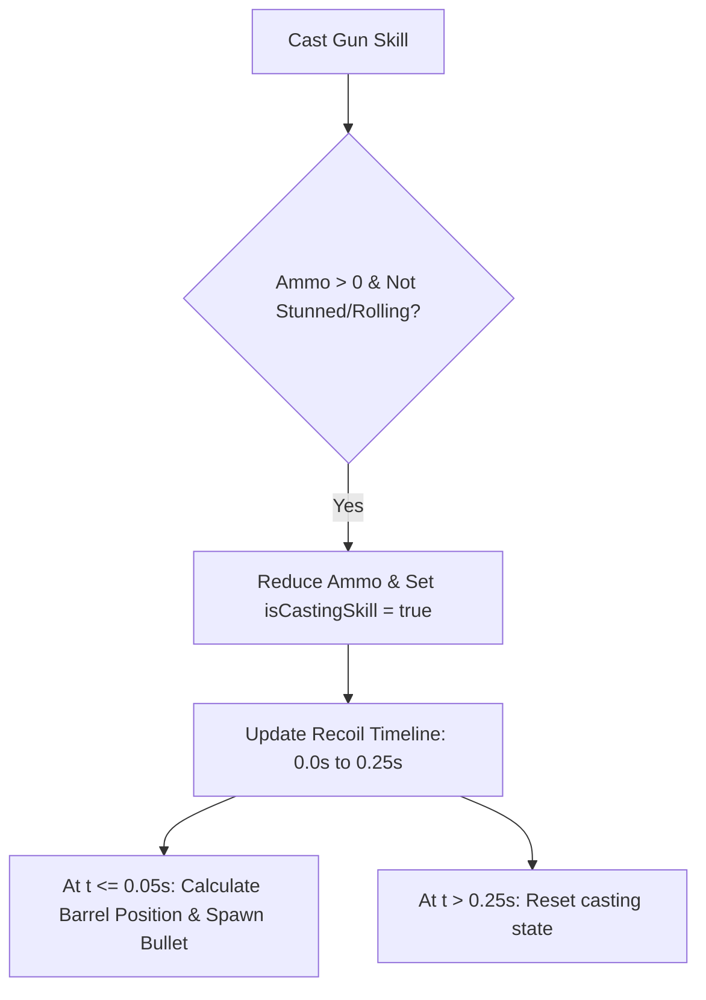

# Project Animation System Documentation

This document provides a comprehensive technical reference for the state-driven and procedural animation systems implemented in the project. It describes the timing thresholds, mathematical equations, matrix transformations, and state transition logic for Kinger, Caine, the Butterfly summon, the Gloinks hazard enemies, and the KingerRoll checker ball representation.

---

## 1. Overview of the Animation Architecture
The project utilizes a state-driven procedural animation system built on OpenGL. Instead of playing back pre-baked keyframe clips, the characters' movements (such as breathing sways, arm recoils, weapon aim blending, and squash-and-stretch deformations) are computed programmatically per frame using cumulative timers, trigonometry (sine/cosine waves), and matrix manipulations (`glRotatef`, `glTranslatef`, `glScalef`).

---

## 2. Kinger Animation System
*   **Controller Class**: `Kinger` ([Kinger.cpp](file:///c:/Users/User/Desktop/TCG6223-Project-Source-Code/Kinger.cpp))
*   **Animation State Machine**: `KingerAnimation` ([KingerAnimation.hpp](file:///c:/Users/User/Desktop/TCG6223-Project-Source-Code/KingerAnimation.hpp) | [KingerAnimation.cpp](file:///c:/Users/User/Desktop/TCG6223-Project-Source-Code/KingerAnimation.cpp))

### 2.1 Idle State
The idle animation operates continuously while Kinger is alive. It uses a cumulative timer `idleTimer` to drive breathing bobbing, cloth sway, and arm swaying.
*   **Vertical Bobbing (Hover Offset)**: A smooth harmonic vertical displacement applied to the torso, head, and bucket:
    $$\text{hoverOffset} = 1.2 \cdot \sin(2.0 \cdot \text{idleTimer})$$
*   **Cloth Sway (Cloth Rotation)**: Cape cloth oscillates around the local Z-axis:
    $$\text{clothRotation} = 3.0 \cdot \cos(2.5 \cdot \text{idleTimer})$$
*   **Idle Arm Sway**: Arm rotation dynamically fades out when active gestures (like shooting) take over. This is managed by `armSwayWeight` (interpolates to $0.0$ at speed $15.0/\text{sec}$ when casting, and back to $1.0$ at speed $5.0/\text{sec}$ when idle):
    $$\text{armRotation} = \left(4.0 \cdot \sin(1.8 \cdot \text{idleTimer})\right) \cdot \text{armSwayWeight}$$

### 2.2 Gun Shot Recoil & Projectile Trajectory
When Kinger shoots, the system performs a recoil animation and spawns a physical projectile with a calculated world-space trajectory.



#### Recoil Timeline (Duration: 0.25s)
*   **Stage 1: Kickback (0.0s to 0.05s)**: Linear Z-axis offset to simulate weapon pushback:
    $$\text{armRecoilOffset} = \left(\frac{\text{skillTimer}}{0.05}\right) \cdot 3.0$$
*   **Stage 2: Easing Recovery (0.05s to 0.25s)**: Smooth cosine easing back to standard pose:
    $$t_{\text{ease}} = \frac{\text{skillTimer} - 0.05}{0.20}$$
    $$\text{armRecoilOffset} = 3.0 \cdot \cos\left(t_{\text{ease}} \cdot \frac{\pi}{2}\right)$$

#### Projectile Trajectory calculations
The bullet spawns at the gun barrel tip. First, local coordinates are computed using local barrel pivots and camera aiming pitch ($\theta_{\text{pitch}}$), scaled by `modelScale`:
*   $\text{localY} = \text{PIVOT\_Y} + \text{BARREL\_Z} \cdot \sin(\theta_{\text{pitch}} + 27^\circ)$
*   $\text{localZ} = \text{BARREL\_Z} \cdot \cos(\theta_{\text{pitch}} + 27^\circ)$

These are transformed into world space using a 2D rotation matrix driven by the player's yaw ($\psi_{\text{yaw}}$):
*   $\text{worldOffsetX} = \text{ARM\_OFFSET\_X} \cdot \cos(\psi_{\text{yaw}}) + \text{localZ} \cdot \sin(\psi_{\text{yaw}})$
*   $\text{worldOffsetZ} = -\text{ARM\_OFFSET\_X} \cdot \sin(\psi_{\text{yaw}}) + \text{localZ} \cdot \cos(\psi_{\text{yaw}})$

The bullet moves at `BULLET_TRAVEL_SPEED = 500.0f` along the direction vector:
$$\vec{D} = \begin{bmatrix} -\sin(\psi_{\text{yaw}}) \cdot \cos(\theta_{\text{pitch}}) \\ -\sin(\theta_{\text{pitch}}) \\ -\cos(\psi_{\text{yaw}}) \cdot \cos(\theta_{\text{pitch}}) \end{bmatrix}$$

### 2.3 Dodge Roll (Duration: 0.5s)
Initiated via dodge input. It alters Kinger's model, movement speed ($2.5\times$ speed multiplier), and scale factor.

| Phase | Time Interval | Model Rendered | scaleY Factor | Description |
| :--- | :--- | :--- | :--- | :--- |
| **0** | $0.0\text{s} \to 0.1\text{s}$ | Standard Kinger | $1.0 \to 0.3$ | Windup squashing sequence along the vertical axis. |
| **1** | $0.1\text{s} \to 0.4\text{s}$ | KingerRoll Checker Ball | $1.0$ (Ball) | Swap to ball representation, spinning at $\text{rollTimer} \cdot 1500^\circ$ on X-axis. |
| **2** | $0.4\text{s} \to 0.5\text{s}$ | Standard Kinger | $0.3 \to 1.0$ | Stretch-recovery sequence returning back to normal scale. |
| **3** | $> 0.5\text{s}$ | Standard Kinger | $1.0$ | Recovery finished; resets rolling states. |

### 2.4 Reload State (Duration: 1.0s)
Reloading temporarily replaces standard aim orientations with a multi-phase manual reload animation:
*   **Phase 1: Arm Raising ($0.0\text{s} \to 0.3\text{s}$)**: Left and right arms rotate up to reload positions:
    *   $\text{leftArmReloadPitch} \to -120^\circ$
    *   $\text{leftArmReloadYaw} \to -135^\circ$
    *   $\text{leftArmReloadYOffset} \to 10.0$
    *   $\text{rightArmReloadPitch} \to -60^\circ$
*   **Phase 2: Reload Shake ($0.3\text{s} \to 0.7\text{s}$)**: Harmonic shaking of the hands:
    *   $\text{leftArmReloadPitch} = -120^\circ + 5^\circ \cdot \sin(\text{reloadTimer} \cdot 30.0)$
    *   $\text{rightArmReloadPitch} = -60^\circ + 2^\circ \cdot \cos(\text{reloadTimer} \cdot 30.0)$
*   **Phase 3: Arm Lowering ($0.7\text{s} \to 1.0\text{s}$)**: Smooth linear return of arms back to default positions ($0.0$). Reload completes and resets ammo to `MAX_AMMO` (30).

### 2.5 Butterfly Heal State (Duration: 2.0s)
Restores $30\text{ HP}$, consumes $1$ butterfly charge, and locks character movement.
*   **Left Arm Gesture**:
    *   $0.0\text{s} \to 0.5\text{s}$: Left arm raises to a vertical summon posture ($\text{leftArmHealPitch} \to -180^\circ$).
    *   $0.5\text{s} \to 1.5\text{s}$: Arm held static at $-180^\circ$.
    *   $1.5\text{s} \to 2.0\text{s}$: Left arm returns smoothly back to $0^\circ$.
*   **Butterfly Mesh Spawning**: Spawns a separate ProjectButterfly actor at the left hand that travels to Kinger's head bucket (detailed in Section 4).

### 2.6 Damage Stun (Hurt) & Death State
*   **Hurt State (Duration: 0.5s)**: Triggers upon taking damage.
    *   *Interruption*: Immediately cancels gunshot, reload, dodge roll, and healing states.
    *   *Stun Speed*: Cuts movement speed in half ($0.5\times$ multiplier).
    *   *Flashing effect*: Toggles model visibility every $0.05$ seconds (yielding a $10\text{ Hz}$ blinking effect).
    *   *Red Flash*: Disables textures and applies a solid red material emissive overlay.
*   **Death State**: Triggers when health drops to $0$.
    *   *Minecraft-style Stiff Collapse*: Kinger pivots around his bottom boundary ($Y = -18.7$) and falls stiffly $90^\circ$ to the right side of the screen over $1.0\text{ second}$ ($\theta_{\text{fall}} = \text{progress} \cdot 90^\circ$).
    *   *Gravity Slide*: Constant vertical gravity force applied ($V_y = V_y - 50.0 \cdot \Delta t$) pushing Kinger downward until hitting the ground.
    *   *Solid Red Material*: Textures disabled, solid red emissive material overlay.
    *   *Rebirth*: Respawns player at $(0.0, -18.7, 0.0)$ after exactly $1.0\text{ second}$ delay (`RESPAWN_DELAY`).

### 2.7 Procedural Leaning & Landing Squash
*   **Movement Leaning**: Moves forward/backward or strafes left/right and interpolates lean angles at a speed of $3.0$:
    *   *Pitch Lean*: Leans forward/backward ($\pm \text{MAX\_LEAN\_ANGLE}$) when moving forward/backward.
    *   *Roll Lean*: Leans sideways ($\pm \text{MAX\_LEAN\_ANGLE}$) when strafing left/right.
*   **Landing Squash**: Upon hitting the ground after falling or jumping, Kinger's vertical scale factor `jumpScaleY` snaps to $0.8$ (squashing down) and recovers back to $1.0$ at a rate of $10.0 \cdot \Delta t$.

---

## 3. Caine Boss Animation System
*   **Controller Class**: `Caine` ([Caine.cpp](file:///c:/Users/User/Desktop/TCG6223-Project-Source-Code/Caine.cpp))
*   **Animation State Machine**: `CaineAnimation` ([CaineAnimation.hpp](file:///c:/Users/User/Desktop/TCG6223-Project-Source-Code/CaineAnimation.hpp) | [CaineAnimation.cpp](file:///c:/Users/User/Desktop/TCG6223-Project-Source-Code/CaineAnimation.cpp))

### 3.1 Idle State
*   **Smooth Hovering**: Caine procedurally bobs up and down in the air:
    $$\text{hoverOffset} = \sin(\text{idleTimer} \cdot 2.0) \cdot 1.2$$
*   **Breathing Body Tilt**: Subtle Z-axis rolling tilt to make the boss feel alive. Uses half the hovering frequency to avoid matching the bobbing motion:
    $$\text{bodyTiltAngle} = \sin(\text{idleTimer} \cdot 1.0) \cdot 3.0^\circ$$
*   **TMJ Mouth Open Factor**: Continuous sinus-driven factor ranging between $[0.0, 1.0]$ driving separate mouth rotations:
    $$\text{mouthOpenFactor} = 0.5 \cdot \sin(\text{idleTimer} \cdot 4.0) + 0.5$$
    *   *Upper Jaw Rotation (X-axis)*: open/close sway equal to $\text{mouthOpenFactor} \cdot -3.0^\circ$.
    *   *Lower Jaw Rotation (X-axis)*: open/close sway equal to $\text{mouthOpenFactor} \cdot -5.0^\circ$.

### 3.2 Staff Shooting State (Duration: 1.0s)
Caine raises his left hand and points his ringmaster staff forward to fire projectiles at the player.
*   **Phase 1: Hand Raise ($0.0\text{s} \to 0.3\text{s}$)**: Left hand and staff raise up and roll backward.
    *   $\text{pitch} = 180^\circ \cdot f$
    *   $\text{roll} = -30^\circ + (-40^\circ \cdot f)$
    *   Where $f = \sin\left(\frac{\text{shootingTimer}}{0.3} \cdot \frac{\pi}{2}\right)$.
*   **Phase 2: Aim Point ($0.3\text{s} \to 0.7\text{s}$)**: Left hand swings forward to point the staff directly at the player.
    *   $\text{pitch} = 180^\circ - 110^\circ \cdot f$
    *   $\text{roll} = -70^\circ$
    *   Where $f = \sin\left(\frac{\text{shootingTimer} - 0.3}{0.4} \cdot \frac{\pi}{2}\right)$.
*   **Phase 3: Return to Rest ($0.7\text{s} \to 1.0\text{s}$)**: Smooth transition returning the arm back to default.
    *   $\text{pitch} = 70^\circ \cdot (1.0 - f)$
    *   $\text{roll} = -70^\circ + 40^\circ \cdot f$
    *   Where $f = \sin\left(\frac{\text{shootingTimer} - 0.7}{0.3} \cdot \frac{\pi}{2}\right)$.

### 3.3 Lay Down Posture Transformation
Toggled programmatically. Smoothly interpolates `layDownFactor` between $0.0$ and $1.0$ at a rate of $3.0/\text{sec}$.
*   **Translation**: Translates Caine vertically upwards by $\text{layDownFactor} \cdot 20.0$ to clear the ground.
*   **Body Rotation**: Rolls the body sideways on the Z-axis by $\text{layDownFactor} \cdot 70.0^\circ$.
*   **Limbs Realignment**:
    *   *Left Hand & Staff*: Rotates on Z-axis (roll) by $\text{layDownFactor} \cdot 45.0^\circ$ and X-axis (pitch) by $\text{layDownFactor} \cdot 90.0^\circ$.
    *   *Right Hand*: Rotates on Z-axis by $\text{layDownFactor} \cdot -45.0^\circ$ and X-axis by $\text{layDownFactor} \cdot 90.0^\circ$.

### 3.4 Lean Forward Posture Transformation
Toggled programmatically. Smoothly interpolates `leanForwardFactor` between $0.0$ and $1.0$ at a rate of $3.0/\text{sec}$.
*   **Body Rotation**: Pitches body forward on X-axis by $\text{leanForwardFactor} \cdot 45.0^\circ$.
*   **Limbs Realignment**:
    *   *Left Arm*: Rotates on Y-axis (yaw) by $\text{leanForwardFactor} \cdot 45.0^\circ$.
    *   *Right Arm*: Rotates on Y-axis by $\text{leanForwardFactor} \cdot -45.0^\circ$.
*   **Jaw Alignment**: Upper jaw rotates $+5^\circ$, lower jaw rotates $+10^\circ$ (yaw) to simulate screaming lean posture.

### 3.5 Death Sequence
Triggers when Caine's health reaches $0$.
*   **Disappearance Delay**: Caine continues drawing during the first second of dying, then disappears completely when $\text{deathTimer} \ge 1.0\text{s}$.
*   **Neck Tilt**: The head tilts sideways to the left around the local neck pivot on the Z-axis:
    $$\theta_{\text{neck}} = \min(\text{deathTimer}, 1.0) \cdot 20^\circ$$
*   **Jaw Drop**: The lower jaw, upper jaw, and tongue swing wide open:
    $$\theta_{\text{jawDrop}} = \min(\text{deathTimer}, 1.0) \cdot 15^\circ$$
*   **Respawn**: After exactly $2.0\text{ seconds}$, Caine is resurrected and resets back to his original spawn coordinates.

---

## 4. Butterfly Summon Animation
*   **Summon Actor Class**: `Butterfly` ([Butterfly.hpp](file:///c:/Users/User/Desktop/TCG6223-Project-Source-Code/Butterfly.hpp) | [Butterfly.cpp](file:///c:/Users/User/Desktop/TCG6223-Project-Source-Code/Butterfly.cpp))
*   **Spawning & Flight Path**: Programmed in `Kinger::draw` ([Kinger.cpp](file:///c:/Users/User/Desktop/TCG6223-Project-Source-Code/Kinger.cpp))

```
  (Left Hand summon)                      (Flying path)                   (Head bucket)
     [Spawns at Hand]  ===============================================>  [Absorbed at Bucket]
        (0.0s - 0.5s)                      (0.5s - 1.5s)                     (1.5s - 2.0s)
      Wing flap: 20Hz                    Wing flap: 20Hz                  Wing flap stops (0)
     Scale: 1.0 (Static)                Linear fly translation             Scale: 1.0 -> 0.0
                                                                          Green Cross Particles
```

### 4.1 Wing Flapping Animation
Driven by the current butterfly wing-flapping angle `flapAngle`.
*   **Left Wing Rotation**: Rotates around local longitudinal axis by $+ \text{flapAngle}$.
*   **Right Wing Rotation**: Rotates around local longitudinal axis by $- \text{flapAngle}$ (symmetric mirror).
*   **Flapping Speed**: Flaps at $20\text{ Hz}$ when active:
    $$\text{flapAngle} = \sin(\text{healTimer} \cdot 20.0) \cdot 30.0^\circ$$

### 4.2 Flight Path Interpolation
1.  **Hand Start Position**: Calculated by taking the left hand offset relative to Kinger ($\vec{H}_{\text{local}} = [-20.0, 15.0, -15.0]\cdot \text{scale}$), rotating it by Kinger's yaw ($\psi$), and adding Kinger's world position:
    *   $\text{handWorldX} = P_x + (H_x \cdot \cos(\psi) + H_z \cdot \sin(\psi))$
    *   $\text{handWorldY} = P_y + 18.7 + H_y$
    *   $\text{handWorldZ} = P_z + (-H_x \cdot \sin(\psi) + H_z \cdot \cos(\psi))$
2.  **Bucket End Position**: Positioned at Kinger's head/bucket height:
    *   $\text{bucketWorldX} = P_x$
    *   $\text{bucketWorldY} = P_y + 18.7 + 25.0 \cdot \text{scale}$
    *   $\text{bucketWorldZ} = P_z$
3.  **Summon Timeline stages**:
    *   **Stage 1: Hover Spawning ($0.0\text{s} \to 0.5\text{s}$)**: Stays at the hand ($\text{flyX} = \text{handWorldX}$, etc.). Flaps wings.
    *   **Stage 2: Travel Fly ($0.5\text{s} \to 1.5\text{s}$)**: Linearly interpolates from hand to bucket using parameter $t = \frac{\text{healTimer} - 0.5}{1.0}$:
        $$\vec{P}_{\text{fly}} = \vec{P}_{\text{hand}} + t \cdot (\vec{P}_{\text{bucket}} - \vec{P}_{\text{hand}})$$
        Flaps wings.
    *   **Stage 3: Absorption ($1.5\text{s} \to 2.0\text{s}$)**: Static at bucket ($\vec{P}_{\text{fly}} = \vec{P}_{\text{bucket}}$). Flapping stops (`flapAngle = 0`). Scales down to zero:
        $$\text{scale} = 1.0 - \left(\frac{\text{healTimer} - 1.5}{0.5}\right)$$

### 4.3 Orbiting Health Cross Particles
During the absorption stage ($\text{healTimer} \ge 1.5\text{s}$), $3$ green cross particles ($c_0, c_1, c_2$) orbit and float up from Kinger's head.
*   **Color**: Solid green with no lighting ($\text{RGB} = [0.2, 1.0, 0.2]$).
*   **Flight offset timer**: $t_{\text{offset}} = (\text{healTimer} - 1.5) + (i \cdot 0.1)$ for particle index $i \in \{0, 1, 2\}$.
*   **Vertical Rising**: $\text{height} = t_{\text{offset}} \cdot 15.0$
*   **Circular Orbit Path**:
    *   $\text{orbitX} = \sin(t_{\text{offset}} \cdot 10.0 + i) \cdot 3.0$
    *   $\text{orbitZ} = \cos(t_{\text{offset}} \cdot 10.0 + i) \cdot 3.0$
*   **Spin**: Rotates around Y-axis by $t_{\text{offset}} \cdot 300.0^\circ$.
*   **Scale Fade**: Fades to zero size as it rises:
    $$\text{crossScale} = \max\left(1.0 - \frac{\text{height}}{10.0}, 0.0\right) \cdot 0.7$$
*   **Structure**: Composed of two intersecting scaled solid cubes (vertical part scaled $[0.6, 2.0, 0.6]$, horizontal part scaled $[2.0, 0.6, 0.6]$).

---

## 5. Gloinks Hazard Enemy Animation
*   **Manager Class**: `GloinksAnimation` ([GloinksAnimation.hpp](file:///c:/Users/User/Desktop/TCG6223-Project-Source-Code/GloinksAnimation.hpp) | [GloinksAnimation.cpp](file:///c:/Users/User/Desktop/TCG6223-Project-Source-Code/GloinksAnimation.cpp))

### 5.1 Jumping & Spinning movement
*   **Sinusoidal Bounce Curve**: Gloinks bounce along the ground level ($Y = -18.7$):
    $$\text{posY} = -18.7 + \left|\sin(\text{jumpTimer} \cdot 3.0)\right| \cdot 5.0$$
*   **Z-Axis Spinning Roll**: Rotates continuously on the Z-axis while alive:
    $$\theta_{\text{spin}} = \text{jumpTimer} \cdot 90.0^\circ/\text{sec}$$

### 5.2 Hurt Squash & Stretch Sandwich
When hit by a bullet, a Gloink triggers a hurt state for $0.5\text{ seconds}$ with a squash/stretch matrix deformation.
*   **Hurt Intensity**: Fades linearly:
    $$\text{hurtIntensity} = 1.0 - \frac{\text{hurtTimer}}{0.5}$$
*   **Pivot Matrix Sandwich**: To scale the shape starting from its bottom center pivot rather than the model origin, the system sandwiches the scaling matrices between local translations:
    1.  Translate the bottom center to origin: `glTranslatef(0.0f, -center.y, 0.0f)`
    2.  Apply scale stretch distortion:
        $$\text{scale} = \begin{bmatrix} 1.0 + 0.3 \cdot \text{hurtIntensity} \\ 1.0 - 0.5 \cdot \text{hurtIntensity} \\ 1.0 + 0.3 \cdot \text{hurtIntensity} \end{bmatrix}$$
    3.  Translate back: `glTranslatef(0.0f, center.y, 0.0f)`
*   **Color Flash**: Flash color interpolates linearly to white-red:
    $$\text{Color} = \begin{bmatrix} 1.0 \\ 1.0 - \text{hurtIntensity} \\ 1.0 - \text{hurtIntensity} \end{bmatrix}$$

### 5.3 Death Fall Animation
When health reaches $0$, the Gloink falls sideways over $1.0\text{ second}$ before reviving.
*   **Minecraft Stiff Fall**: Uses a bottom pivot sandwich to rotate the Gloink $90^\circ$ sideways onto the ground:
    1.  Translate bottom center to origin: `glTranslatef(0.0f, -center.y, 0.0f)`
    2.  Rotate sideways: `glRotatef(progress * 90.0f, 0.0f, 0.0f, 1.0f)`
    3.  Translate back: `glTranslatef(0.0f, center.y, 0.0f)`
*   **Glow Overlay**: Textures are disabled and solid red emission material attributes are enabled:
    *   $\text{Emission} = [1.0, 0.0, 0.0, 1.0]$
    *   $\text{Diffuse} = [1.0, 0.0, 0.0, 1.0]$
    *   $\text{Ambient} = [1.0, 0.0, 0.0, 1.0]$
    *   $\text{Specular} = [0.0, 0.0, 0.0, 1.0]$

---

## 6. KingerRoll Checker Ball Animation
*   **Model Wrapper Class**: `KingerRoll` ([KingerRoll.hpp](file:///c:/Users/User/Desktop/TCG6223-Project-Source-Code/KingerRoll.hpp) | [KingerRoll.cpp](file:///c:/Users/User/Desktop/TCG6223-Project-Source-Code/KingerRoll.cpp))

Used to render Kinger as a rolling ball during Phase 1 of the dodge roll skill.
*   **Model Reorientation**:
    *   Rotates model $180^\circ$ around Y-axis to align facing direction with forward movement.
    *   Scales model uniformly by $5.0$.
*   **Dodge Roll Spin**: The ball spins around the local X-axis to simulate rolling along the floor:
    $$\theta_{\text{rollSpin}} = \text{rollTimer} \cdot 1500.0^\circ$$
